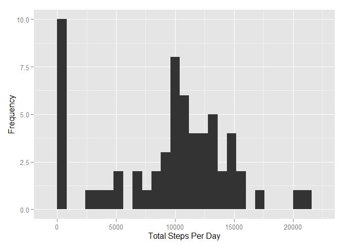
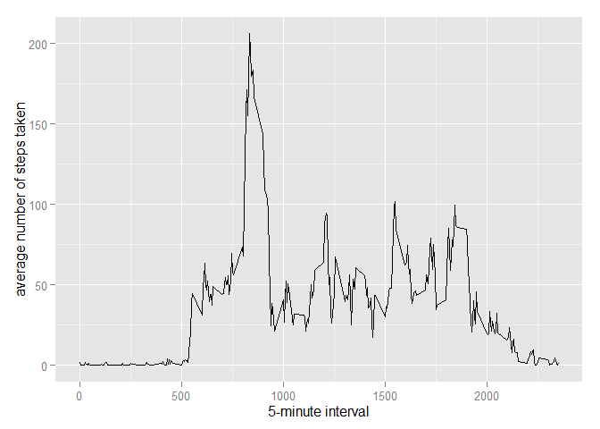
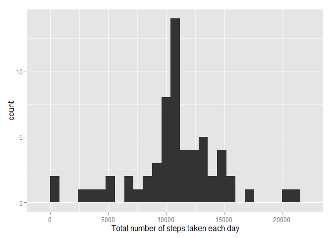
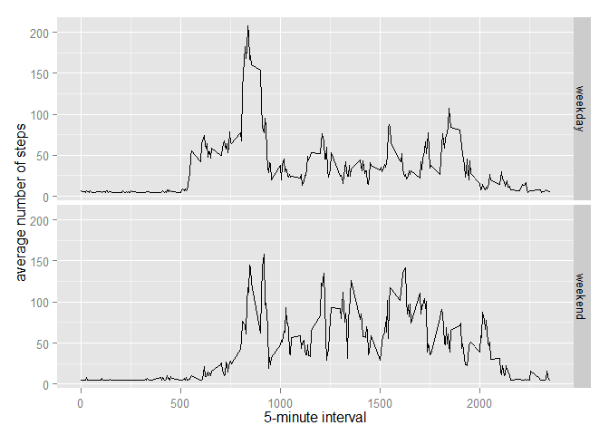

# PA1_template.Rmd
Viswa  
Saturday, January 17, 2015  

This is an R Markdown document. Markdown is a simple formatting syntax for authoring HTML, PDF, and MS Word documents. For more details on using R Markdown see <http://rmarkdown.rstudio.com>.

When you click the **Knit** button a document will be generated that includes both content as well as the output of any embedded R code chunks within the document. You can embed an R code chunk like this:

**Assignment Markdown starts here**
Load required libraries

```r
library(ggplot2)
```

Loading Activity Data

```r
ActivityData <- read.csv("activity.csv")
```

What is mean total number of steps taken per day?

```r
TotalStepsByDay <- tapply(ActivityData$steps,ActivityData$date,sum,na.rm=TRUE)
```

1. Make a histogram of the total number of steps taken each day

```r
#hist(MeanStepsByDay, xlab = 'Total Steps Per Day',ylab = 'Frequency', plot=TRUE)
qplot(TotalStepsByDay, xlab = 'Total Steps Per Day',ylab = 'Frequency', plot=TRUE,binwidth=800)
```

 

2. Calculate and report the mean and median total number of steps taken per day

```r
MeanStepsByDay <- mean(TotalStepsByDay)
MedianStepsByDay <- median(TotalStepsByDay)
```
*** Mean steps by day is 9354.2295082
*** Median steps by day is 10395


What is the average daily activity pattern?

```r
averageSteps <- aggregate(x=list(mean=ActivityData$steps),by=list(interval=ActivityData$interval), FUN=mean, na.rm=TRUE)
```

1. Make a time series plot (i.e. type = "l") of the 5-minute interval (x-axis) and the average number of steps taken, averaged across all days (y-axis)

```r
ggplot(data=averageSteps, aes(x=interval, y=mean)) + geom_line() + xlab("5-minute interval") + ylab("average number of steps taken")
```

 

2. Which 5-minute interval, on average across all the days in the dataset, contains the maximum number of steps?

```r
averageSteps[which.max(averageSteps$mean),]
```

```
##     interval     mean
## 104      835 206.1698
```

Imputing missing values
Note that there are a number of days/intervals where there are missing values (coded as NA). The presence of missing days may introduce bias into some calculations or summaries of the data.

1. Calculate and report the total number of missing values in the dataset (i.e. the total number of rows with NAs)

```r
numMissingValues <- length(which(is.na(ActivityData$steps)))
```
*** Total number of missing values: 2304

2. Devise a strategy for filling in all of the missing values in the dataset. The strategy does not need to be sophisticated. For example, you could use the mean/median for that day, or the mean for that 5-minute interval, etc.
3. Create a new dataset that is equal to the original dataset but with the missing data filled in

```r
FilledActivityData <- ActivityData
FilledActivityData$steps <- replace (FilledActivityData$steps, is.na(FilledActivityData$steps), mean(FilledActivityData$steps, na.rm=TRUE))
```

4. Make a histogram of the total number of steps taken each day and Calculate and report the mean and median total number of steps taken per day.

```r
StepsEachDay <- tapply(FilledActivityData$steps, FilledActivityData$date, FUN = sum)
qplot(StepsEachDay, xlab = "Total number of steps taken each day", binwidth = 800)
```

 

```r
mean(StepsEachDay)
```

```
## [1] 10766.19
```

```r
median(StepsEachDay)
```

```
## [1] 10766.19
```

Are there differences in activity patterns between weekdays and weekends?
1. For this part the weekdays() function may be of some help here. Use the dataset with the filled-in missing values for this part.

Create a new factor variable in the dataset with two levels - "weekday" and "weekend" indicating whether a given date is a weekday or weekend day.


```r
FilledActivityData$dateWDorWE <- ifelse(as.POSIXlt(FilledActivityData$date)$wday %in% c(0,6), 'weekend', 'weekday')
```

Make a panel plot containing a time series plot (i.e. type = "l") of the 5-minute interval (x-axis) and the average number of steps taken, averaged across all weekday days or weekend days (y-axis).


```r
AvgActivity <- aggregate(steps ~ interval + dateWDorWE, data = FilledActivityData, mean)
ggplot(AvgActivity, aes(interval, steps)) + geom_line() + facet_grid(dateWDorWE ~ .) + xlab("5-minute interval") + ylab("average number of steps")
```

 
**Assignment Markdown ends here**
